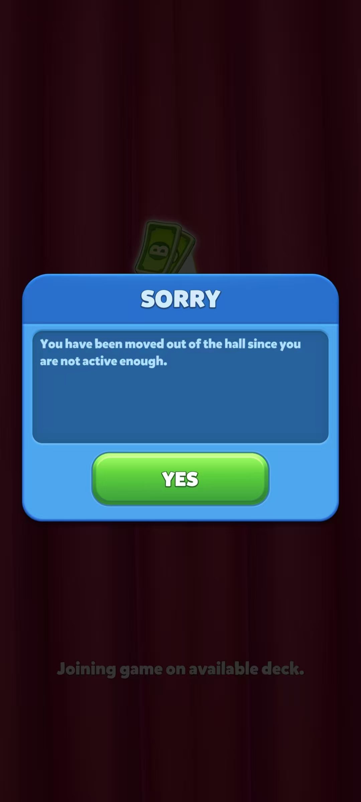

# Bingo Voyage 每日体验记录
## 1. 基础信息
- 记录日期：2026-02-07
- 体验时长：1h
- 玩家等级：189
- 当前关卡：46（3/16）
- 初始资源
  - ticket：711409
  - coin：10020
  - power-up：668

## 2. 新出现的内容
### 2.1 新的活动
- haunted tower

### 2.2 新的发现
- haunted tower活动有两种结算方法，时间结束或者把格子填满

## 3. 当日核心体验
### 3.1 主线关卡情况
- 对局情况：今日累计进行18局对局，达成Bingo共41次，今日整体胜率约39.4%；关卡推进至47（13/16），完成46关卡解锁新装扮，等级提升至198，解锁更高的倍数3000；第6局后解锁全部局外道具booster，胜率有效提升，特别是双倍道具触发作用于双倍标记，炸弹，魔方道具时，胜率大幅度提升
- 资源变化情况：今日剩余700695ticket和10920金币，对局消耗了大量ticket，pick a hat活动消耗828金币
- 关键对局
    1. 第7局完成8次bingo且触发lucky smash(13000)，第一个完成bingo（2500），共35767
    2. 第10局局内完成8次bingo，super cannon完成一次且触发两次lucky smash(3700+26000)，结算双倍奖励道局共114136

### 3.2 活动情况
- daily bonus
  - 当前进度
    - 总进度：23/30
    - 周进度：6/7

- match the ice cream 
  - 投掷两颗骰子，点数为4，获得100金币

- leaderboard
  - 当前段位：第三阶段
  - 当前进度
    - gift collected：20/20
    - 奖杯数：43700
    - 当日名次：2

- pass（通行证）
  - 当日进度：22/30（上升4）

- carnival beats
  - 当前进度
    - 总收集进度：134/216（今日新增9张卡片）
    - 卡组收集进度：6/24（今日新集齐一个卡组）
    - card star（兑换卡包道具）：618（当日新增202个）
    - pick a hat（内置活动）：12/12（连续触发三次小丑事件，损失18个宝箱图案道具，21个宝箱图案道具和828金币）

- wing cup
  - 当前进度：完成两次

- polar dream scape
  - 当前进度：stage 6

- haunted tower
  - 当前进度：完成两次

## 4. 遇见的问题
1.  （新问题）

## 5. 待验证
- haunted tower活动规则
- 什么情况下会活跃异常

## 6.优化建议（个人观点）
- vip gift每日免费奖励有点少，建议将奖励适当增加一点
- friends模块中request中有好友请求卡片右上角会显示红点，建议点开看过后让右上角上面的红点消失或者如果我也没有那张卡片就不要因为这个请求显示红点

