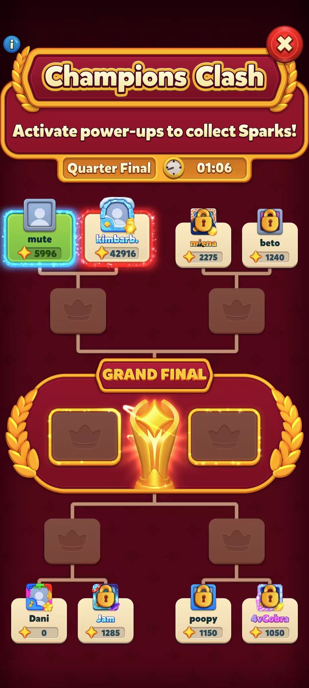

# Royal Match 每日体验记录：2026-02-07
## 1. 基础信息
- 体验时长：1小时
- 完成关卡：675-692关
- 初始资源
  - 当前区域：area 20
  - coin（金币）：3535
  - live（体力）：满
  - earn star（星星）：125
  - booster
    - 局外道具
      - rocket（火箭）：184
      - TNT（炸药）：152
      - light ball（彩虹球）：116
    - 局内道具
      - hammer：28
      - arrow：18
      - cannon：9
      - jester hat：58

## 2. 新的发现
- magic cauldron活动结束后不会立即消失，点开活动将药水使用完，领取对应奖励后活动才会下架

## 3. 今日核心体验
### 3.1 关卡情况
- 今日对局保持连胜，关卡推进至692，今日有特殊关卡king's night，共使用了一次金币增加步数和多次局内道具，较昨日难度无明显上升，今日出现的活动多，活动推进进度明显

### 3.2 活动情况
- leaderboard（weekly contest）
  - 进度：
    - score（分数）：113（上升18）
    - 排名：2（不变）

- propeller madness
  - 进度：8/20

- dragon nest
  - 进度
    - 收集弹珠数量：135
    - 完成进度：0/4

- archery arena
  - 进度：14/20

- sky race
  - 进度：完成一次

- puzzle break
  - 进度
    - 拼图收集数量：61
    - 奖励进度：0/10

- lava quest
  - 进度：已完成（获得910金币）

- champions clash
  - 进度：失败一次，完成一次
  - 失败原因：对方在10分钟内收集50126活动物品，根本无法赶超
  - 感受：这个活动平衡性有待提升，因为有的关卡比较特殊，很轻松就可以合成大量道具，可刷大量分数；让正常进行关卡的玩家无法赶超
  - 遇到的问题：我失败的那次，对手9分钟收集了42916活动物品，比我们另外7个人收集的加到一起还多，根本无法实现赶超

- pass
  - 进度：20/30（上升1）

- mission pursuit
  - 进度
    - 任务进度：0/5
    - 奖励进度：0/3

- team tournament
  - 进度
    - 队伍内排名：3
    - 团队排名：1
    - 个人收集数量：70
    - 团队收集数量：960

- winter collection
  - 进度
    - 总收集进度：133/135（上升2）
    - 卡组收集进度：13/15（上升1）
    - card star（卡片星星）：294（使用500换了个宝箱）
